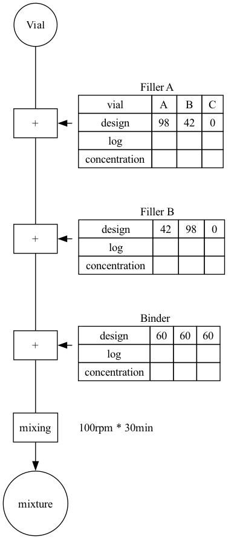

# ELN
配合や合成実験用の電子実験ノート

## 画面構成案

--------------------------------------
### タイトル

フィラー充填比の違いによる特性変化の検証
 
--------------------------------------

### 配合比率の表や合成の反応式

| 混合物名 | フィラーA (wt%) | フィラーB (wt%) | バインダー (wt%)| 総質量 (g) |
|:-------:|--------------:|---------------:|--------------:|----------:|
| A       | 49            | 21             | 30            | 200       |
| B       | 21            | 49             | 30            | 200       |
| C       | 0             | 0              | 100           | 300       |

--------------------------------------

### 材料情報

| 材料名    | 分子量 | 密度 | 溶媒 | 濃度 (wt%) | 濃度 (mM) |
|:---------|------:|----:|------|----------:|----------:|
| フィラーA |       | 5    |     | 100       |           |
| フィラーB |       | 5    |     | 100       |           |
| バインダー |      | 1    |     | 100       |           |

--------------------------------------

### 実験手順のフローチャート

